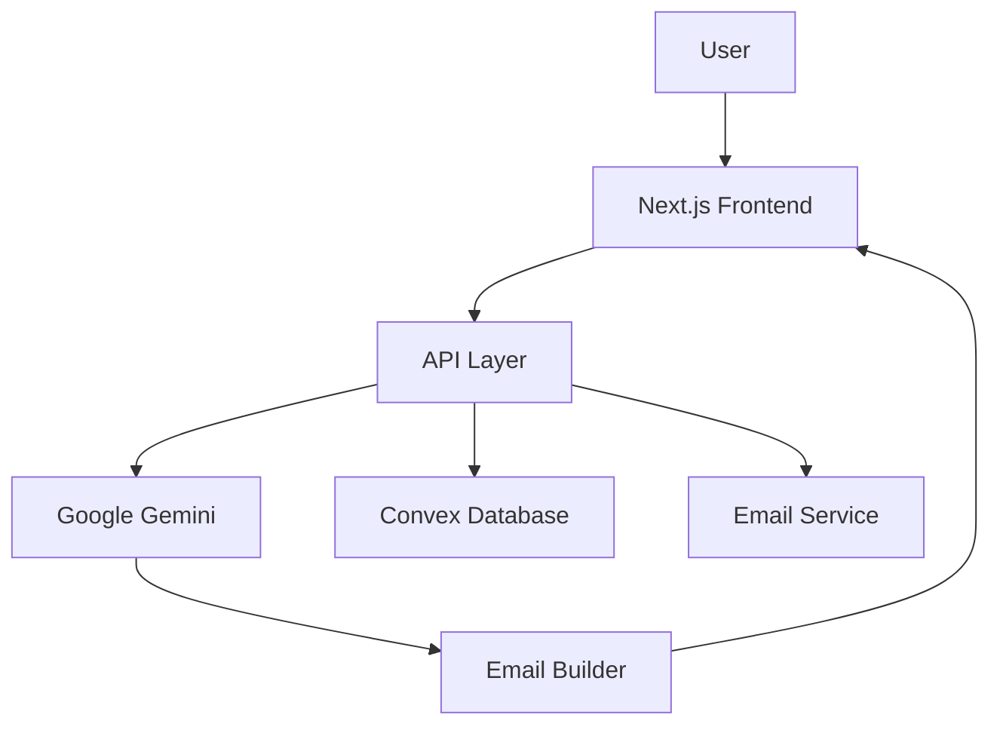
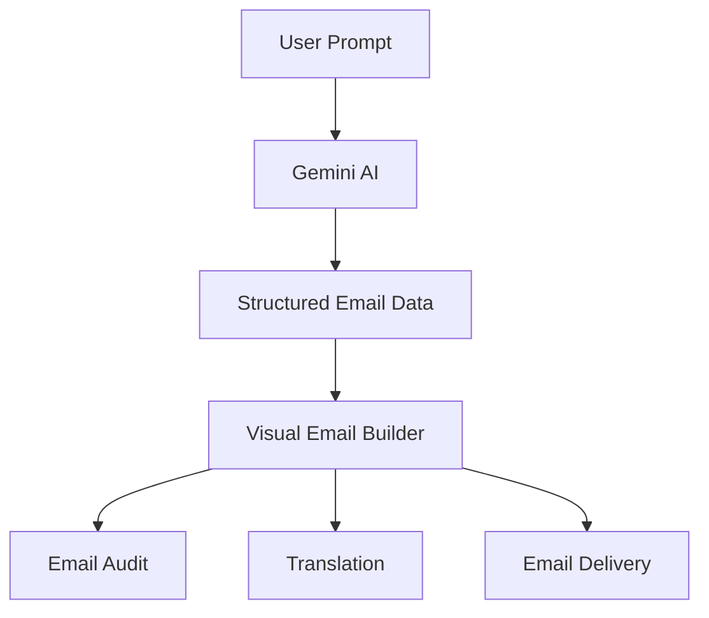
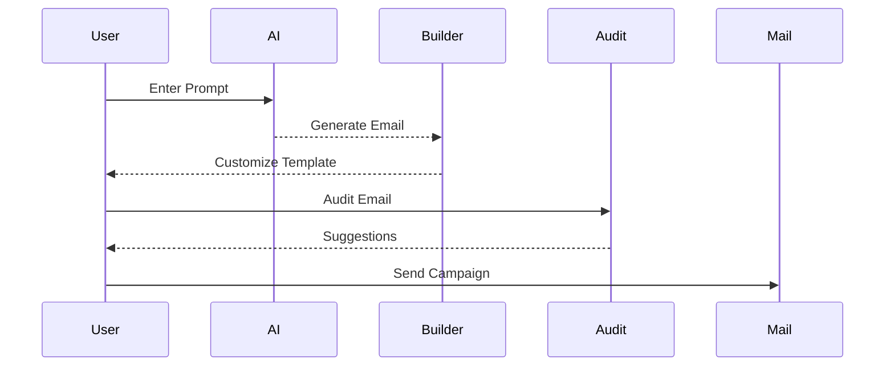

# 🚀 AutoMailr AI

<div align="center">

### AI-Powered Email Generation, Optimization & Delivery Platform

Generate professional email campaigns using AI, customize them through a visual drag-and-drop builder, audit content quality, translate across languages, and send emails—all from a single platform.


</div>

---

## 📖 Overview

AutoMailr AI is a full-stack AI-powered email creation platform designed to simplify the entire email marketing workflow.

Traditional email campaign creation often requires multiple tools for content writing, design, optimization, translation, and delivery. This fragmented workflow increases development time and complexity.

AutoMailr AI consolidates these processes into a single platform by combining:

* AI-powered email generation
* Visual drag-and-drop editing
* Email quality auditing
* Multi-language translation
* Template management
* Email delivery

Users can transform simple text prompts into production-ready email templates within seconds.

---

## 🎯 Problem Statement

Creating professional email campaigns requires significant manual effort.

A typical workflow involves:

* Writing marketing copy
* Designing email layouts
* Checking spam risks
* Translating content
* Testing responsiveness
* Configuring email delivery

Managing these tasks separately can be time-consuming and inefficient.

---

## 💡 Solution

AutoMailr AI leverages Google Gemini AI to generate complete email templates from natural language instructions.

Example:

```text
Create a promotional email for a new AI productivity application with a modern design and call-to-action button.
```

The generated content is automatically rendered within a visual email builder where users can customize components, audit content quality, translate emails, and send campaigns.

---

## ✨ Core Features

### 🤖 AI Email Generation

Generate professional email templates using natural language prompts.

### 🎨 Drag-and-Drop Builder

Create and customize email layouts visually without writing HTML.

### 🔍 AI Email Audit

Analyze emails for:

* Spam score
* Deliverability issues
* Sentiment analysis
* Optimization suggestions

### 🌍 Translation Support

Translate email content into multiple languages while preserving formatting and context.

### 📧 Email Delivery

Send generated email campaigns directly from the application.

### 💾 Template Management

Store, edit, and reuse email templates using Convex.

### 📱 Responsive Design

Create emails optimized for desktop and mobile devices.

---

## 🏗️ System Architecture



---

## ⚡ AI Workflow



---

## 🛠️ Tech Stack

### Frontend

* Next.js 16
* React 19
* Tailwind CSS
* Radix UI
* Lucide React

### Backend

* Next.js API Routes
* Convex

### Artificial Intelligence

* Google Gemini AI
* Prompt Engineering Pipeline

### Email Services

* Nodemailer
* SMTP Providers

---

## 📂 Project Structure

```text
AutoMailr-AI
│
├── app/
├── components/
├── convex/
├── public/
│
├── docs/
│   ├── architecture.md
│   ├── system_design.md
│   ├── ai_pipeline.md
│   ├── email_builder.md
│   ├── database.md
│   ├── api.md
│   └── deployment.md
│
├── package.json
└── README.md
```

---

## 📚 Documentation

Detailed technical documentation is available inside the `docs` directory.

| Document         | Description                                        |
| ---------------- | -------------------------------------------------- |
| architecture.md  | System architecture and component interactions     |
| system_design.md | Design goals, workflows, and engineering decisions |
| ai_pipeline.md   | AI generation, auditing, and translation workflows |
| email_builder.md | Drag-and-drop builder architecture                 |
| database.md      | Convex schema and data model                       |
| api.md           | API endpoints and request lifecycle                |
| deployment.md    | Local setup and production deployment              |

---

## 🚀 Getting Started

### Clone Repository

```bash
git clone https://github.com/Sanat1427/AutoMailr-ai.git

cd AutoMailr-ai
```

### Install Dependencies

```bash
npm install
```

### Configure Environment Variables

Create:

```env
.env.local
```

Add:

```env
NEXT_PUBLIC_CONVEX_URL=

GEMINI_API_KEY=

EMAIL_USER=

EMAIL_PASSWORD=
```

### Start Development Server

```bash
npm run dev
```

Open:

```text
http://localhost:3000
```

---

## 🔄 User Workflow



---

## 🔒 Security Considerations

* API keys remain server-side
* User templates are isolated
* Input validation for AI requests
* Output sanitization before rendering
* Secure environment variable management

---

## 📈 Future Roadmap

### Planned Features

* Campaign Scheduling
* Bulk Email Delivery
* A/B Testing
* Analytics Dashboard
* Template Marketplace
* Team Collaboration
* Version History
* Multi-AI Provider Support
* Email Client Compatibility Testing

---

## 🤝 Contributing

Contributions are welcome.

1. Fork the repository
2. Create a feature branch

```bash
git checkout -b feature/new-feature
```

3. Commit your changes

```bash
git commit -m "Add new feature"
```

4. Push your branch

```bash
git push origin feature/new-feature
```

5. Open a Pull Request

---

## 👨‍💻 Author

**Sanat Kumar**

GitHub: https://github.com/Sanat1427

---

## ⭐ Support

If you found this project helpful, consider giving it a star on GitHub. It helps the project reach more developers and encourages future improvements.

---

Made with ❤️ using Next.js, Convex, and Google Gemini AI.
