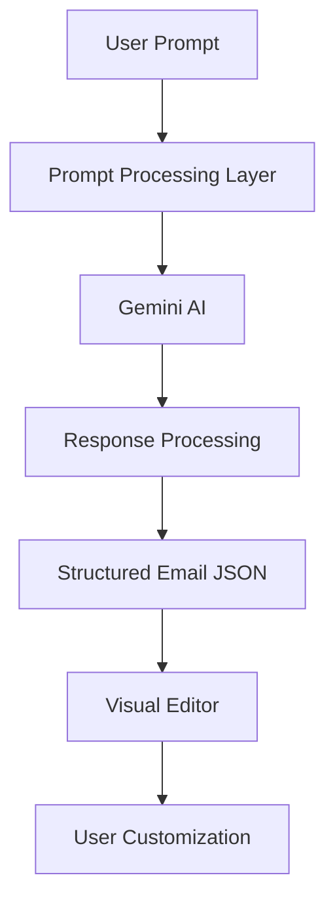
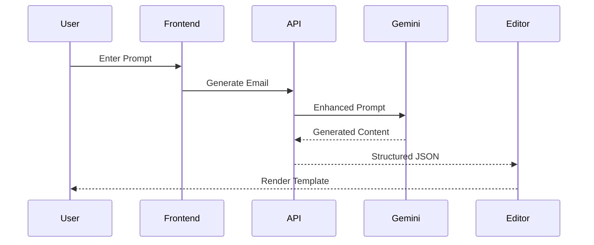
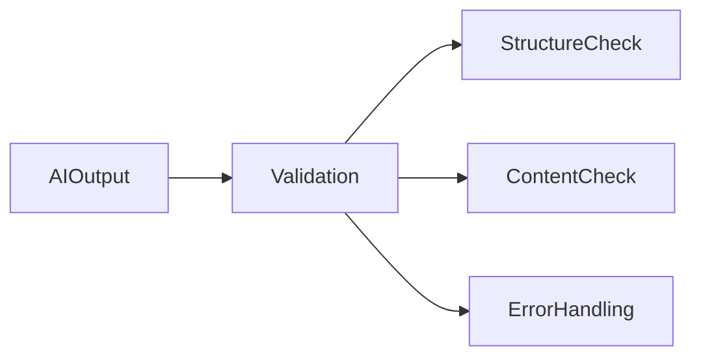
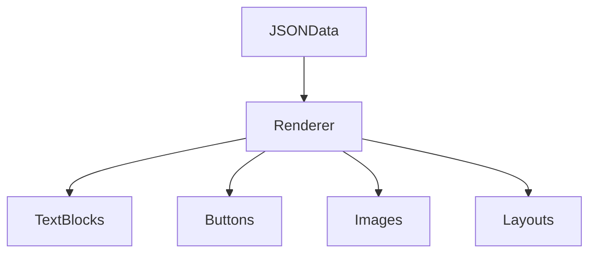
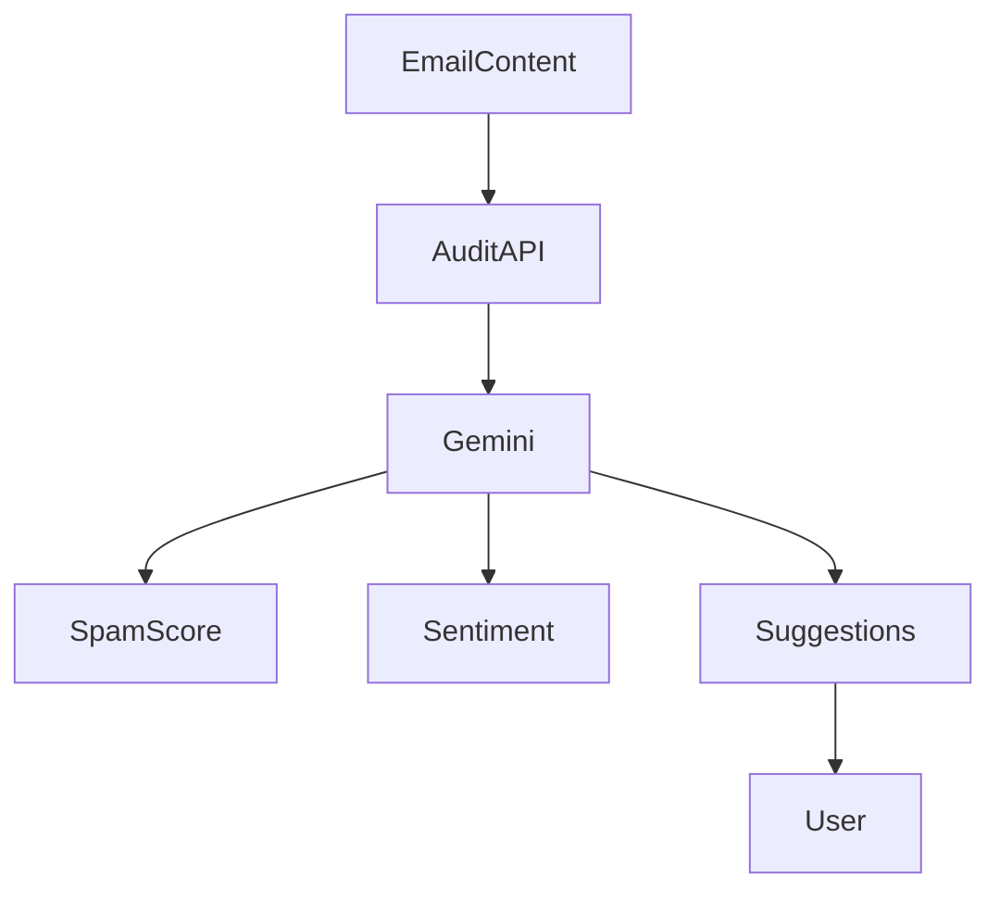
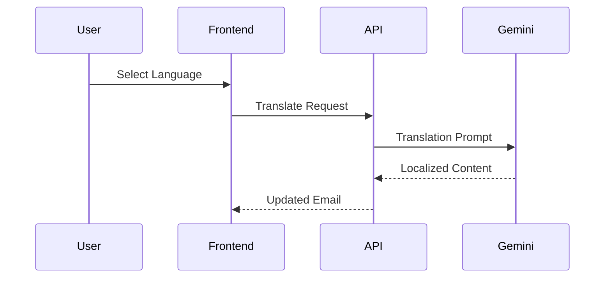
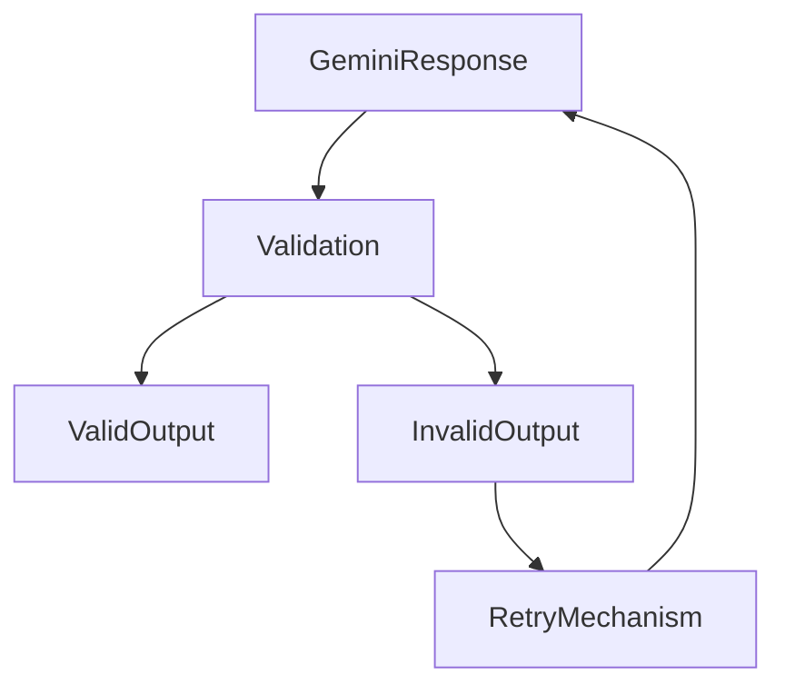

# AI Pipeline Documentation

## Overview

The Artificial Intelligence Pipeline is the core intelligence layer of AutoMailr AI. It powers multiple features including email generation, content enhancement, email auditing, sentiment analysis, spam detection, and multilingual translation.

The platform leverages Google's Gemini model to transform natural language instructions into structured, editable email templates while maintaining consistency, readability, and professional quality.

This document explains how AI flows through the system, how prompts are processed, and how generated content is converted into interactive email components.

---

# AI System Objectives

The AI layer was designed to achieve the following goals:

* Generate professional email templates from natural language prompts.
* Reduce manual content creation effort.
* Produce structured outputs suitable for visual editing.
* Improve email quality through automated auditing.
* Support multilingual communication through translation.
* Maintain consistent formatting across all generated content.

---

# AI Architecture



The AI system acts as an intermediary between user intent and editable email templates.

---

# AI Capabilities

The Gemini integration powers four major workflows:

## 1. Email Generation

Creates complete email templates from user prompts.

Example:

```text
Create a welcome email for new users joining an AI productivity platform.
```

Generated Output:

* Subject line
* Header section
* Body content
* Call-to-action section
* Footer content

---

## 2. Email Audit

Evaluates generated emails for quality and deliverability.

Checks include:

* Spam score estimation
* Sentiment analysis
* Risky phrases
* Marketing effectiveness

---

## 3. Content Improvement

Enhances email copy by:

* Improving readability
* Refining tone
* Increasing clarity
* Optimizing engagement

---

## 4. Translation

Translates email content into target languages while preserving:

* Formatting
* Layout structure
* Brand messaging
* Contextual meaning

---

# Email Generation Pipeline

The email generation workflow consists of multiple stages.



---

# Stage 1: User Prompt Collection

The workflow begins when a user provides a prompt.

Example:

```text
Generate a promotional email for a summer sale with a discount banner and call-to-action button.
```

The prompt represents user intent but does not yet contain enough structure for rendering.

---

# Stage 2: Prompt Engineering

Before sending the request to Gemini, the system enriches the prompt.

Additional instructions may include:

* Email tone
* Layout expectations
* Formatting requirements
* Output structure rules

Example Internal Prompt:

```text
Generate a professional marketing email.

Requirements:
- Include heading
- Include body section
- Include CTA button
- Return structured content
- Maintain professional tone
```

This step increases consistency across generated emails.

---

# Stage 3: AI Content Generation

The processed prompt is sent to Gemini.

Gemini performs:

* Intent understanding
* Content planning
* Marketing copy generation
* Structural organization

Output includes:

* Headings
* Descriptions
* Button text
* Marketing sections

---

# Stage 4: Response Validation

Raw AI output cannot be rendered directly.

The system validates:



Checks include:

* Missing fields
* Invalid formatting
* Empty content
* Parsing failures

---

# Stage 5: JSON Transformation

Validated content is transformed into a structured format.

Example:

```json
{
  "type": "text",
  "content": "Welcome to AutoMailr AI"
}
```

Each generated block becomes an editor component.

Benefits:

* Easy editing
* Component reusability
* Consistent rendering

---

# Stage 6: Visual Rendering

The generated JSON is passed into the editor.



The editor converts AI output into draggable UI components.

---

# Email Audit Pipeline

The audit workflow evaluates email quality before sending.



---

## Spam Detection

The AI identifies:

* Excessive capitalization
* Aggressive sales language
* Suspicious phrases
* Deliverability risks

Example:

```text
LIMITED OFFER!!!
BUY NOW!!!
100% GUARANTEED!!!
```

These patterns may trigger spam filters.

---

## Sentiment Analysis

The audit engine evaluates:

* Professional tone
* Promotional tone
* Friendly tone
* Urgency level

This helps align content with campaign goals.

---

# Translation Pipeline

The translation workflow enables global communication.



---

# Translation Design Goals

The translation engine focuses on:

### Context Preservation

Maintains intended meaning.

### Formatting Preservation

Maintains email structure.

### Brand Consistency

Preserves product names and brand identity.

### Tone Consistency

Maintains professionalism and messaging style.

---

# Error Handling Strategy

AI systems occasionally produce inconsistent outputs.

The platform includes safeguards.



---

# AI Performance Considerations

To maintain responsiveness:

### Lightweight Prompts

Prompts are optimized to reduce token usage.

### Structured Outputs

Responses are requested in predictable formats.

### Error Recovery

Fallback mechanisms handle malformed responses.

### Incremental Processing

Content is rendered immediately after validation.

---

# Security Considerations

The AI layer follows several security practices.

### Server-Side Processing

API keys remain hidden from clients.

### Input Validation

User prompts are validated before processing.

### Output Sanitization

Generated content is cleaned before rendering.

### Rate Limiting (Future)

Future versions may include:

* User quotas
* Request throttling
* Abuse prevention

---

# Future AI Enhancements

Planned AI improvements include:

## Personalized Email Generation

Generate content based on user preferences and history.

## Campaign Optimization

Suggest subject lines and CTA improvements.

## A/B Variant Generation

Generate multiple versions of the same email.

## Audience-Specific Writing

Adapt messaging for different customer segments.

## AI Design Suggestions

Recommend layouts and color schemes automatically.

## Multi-Model Support

Support:

* Gemini
* GPT
* Claude
* Open Source Models

---

# Conclusion

The AI Pipeline is the intelligence backbone of AutoMailr AI. By combining prompt engineering, structured generation, validation, auditing, translation, and content optimization, the platform transforms simple user instructions into professional, editable, and deliverable email campaigns.

This architecture enables rapid campaign creation while maintaining flexibility, quality, and scalability for future enhancements.
