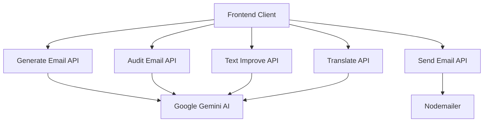
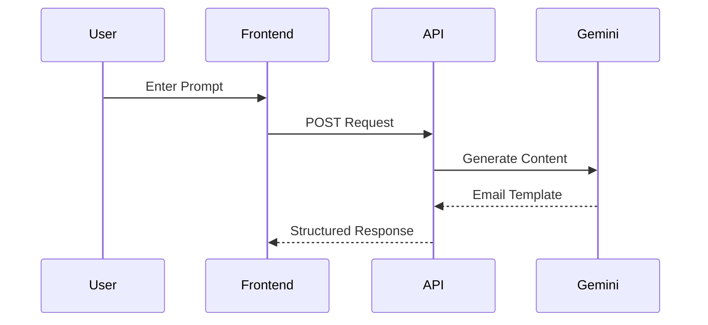
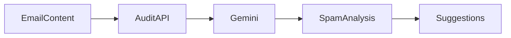
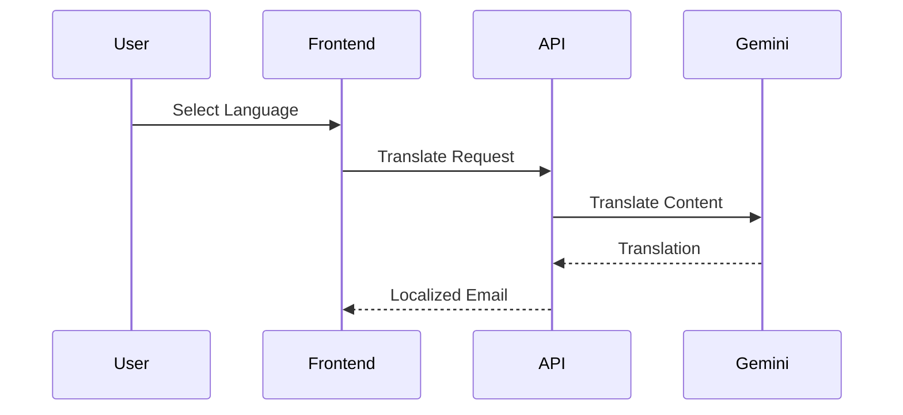
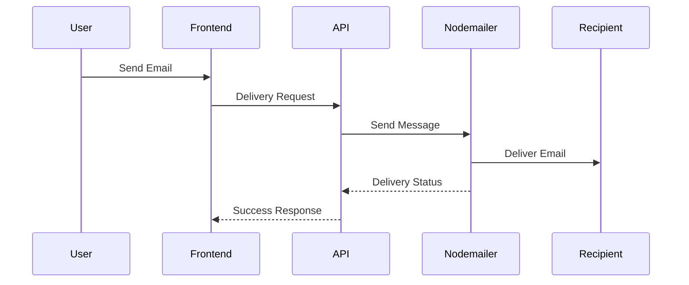
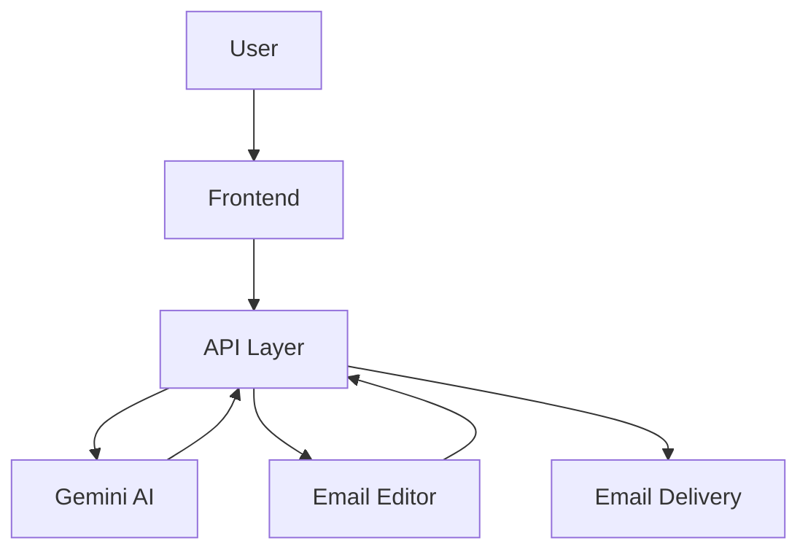

# API Documentation

## Overview

AutoMailr AI exposes a set of API endpoints responsible for AI-powered email generation, content enhancement, translation, auditing, and email delivery.

These APIs act as the communication layer between the frontend application, Google Gemini AI, Convex, and external email services.

---

# API Architecture



---

# Base URL

During development:

```text
http://localhost:3000/api
```

Production:

```text
https://your-domain.com/api
```

---

# Authentication

Most endpoints are designed to operate on behalf of authenticated users.

Future versions may support:

* JWT Authentication
* Session-based Authentication
* API Keys
* Role-Based Access Control

---

# Generate Email API

Generates a complete email template from a natural language prompt.

## Endpoint

```http
POST /api/ai-email-generate
```

---

## Request Flow



---

## Request Body

```json
{
  "prompt": "Create a welcome email for new users"
}
```

---

## Success Response

```json
{
  "success": true,
  "email": {
    "subject": "Welcome to AutoMailr AI",
    "content": "We're excited to have you onboard."
  }
}
```

---

## Status Codes

| Code | Description           |
| ---- | --------------------- |
| 200  | Success               |
| 400  | Invalid Request       |
| 500  | Internal Server Error |

---

# Audit Email API

Analyzes email content and provides quality insights.

## Endpoint

```http
POST /api/ai-email-audit
```

---

## Request Flow



---

## Request Body

```json
{
  "emailContent": "Limited Time Offer!"
}
```

---

## Response

```json
{
  "spamScore": 12,
  "sentiment": "Promotional",
  "suggestions": [
    "Reduce excessive urgency"
  ]
}
```

---

## Audit Metrics

The audit engine evaluates:

* Spam Score
* Sentiment
* Keyword Risk
* Deliverability Recommendations

---

# Text Improvement API

Enhances email copy for clarity and engagement.

## Endpoint

```http
POST /api/ai-text-improve
```

---

## Request Body

```json
{
  "text": "Buy now before offer ends."
}
```

---

## Response

```json
{
  "improvedText": "Don't miss this opportunity. Take advantage of our limited-time offer today."
}
```

---

## Features

* Grammar Improvement
* Readability Enhancement
* Professional Tone Adjustment
* Marketing Optimization

---

# Translate Email API

Translates email content into other languages.

## Endpoint

```http
POST /api/ai-translate
```

---

## Translation Workflow



---

## Request Body

```json
{
  "content": "Welcome to AutoMailr AI",
  "language": "Spanish"
}
```

---

## Response

```json
{
  "translatedContent": "Bienvenido a AutoMailr AI"
}
```

---

## Supported Use Cases

* International Campaigns
* Localization
* Multi-language Marketing
* Customer Outreach

---

# Send Email API

Handles final email delivery.

## Endpoint

```http
POST /api/send-email
```

---

## Email Delivery Flow



---

## Request Body

```json
{
  "to": "user@example.com",
  "subject": "Welcome",
  "html": "<h1>Hello</h1>"
}
```

---

## Response

```json
{
  "success": true,
  "messageId": "abc123"
}
```

---

## Delivery Features

* HTML Email Rendering
* Test Email Delivery
* Preview Support
* Email Validation

---

# Error Handling

All APIs follow a consistent response structure.

## Error Response

```json
{
  "success": false,
  "error": "Invalid request"
}
```

---

# Common Error Codes

| Code | Meaning               |
| ---- | --------------------- |
| 400  | Bad Request           |
| 401  | Unauthorized          |
| 403  | Forbidden             |
| 404  | Resource Not Found    |
| 429  | Rate Limit Exceeded   |
| 500  | Internal Server Error |

---

# API Lifecycle

The following diagram illustrates a complete request journey.



---

# Security Considerations

## Input Validation

All requests should be validated before processing.

## API Key Protection

Gemini API keys remain server-side.

## Output Sanitization

Generated content should be sanitized before rendering.

## Future Improvements

* Rate Limiting
* API Monitoring
* Audit Logging
* Request Analytics

---

# Conclusion

The API layer acts as the communication backbone of AutoMailr AI, connecting the frontend interface with AI services and email delivery providers. Through modular endpoint design and structured request handling, the system remains scalable, maintainable, and easy to extend with future capabilities.
