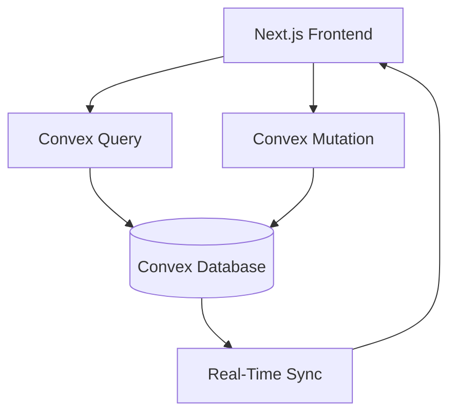
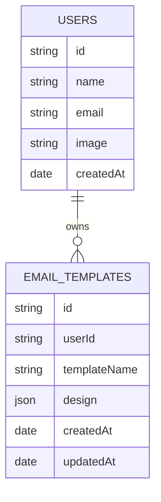
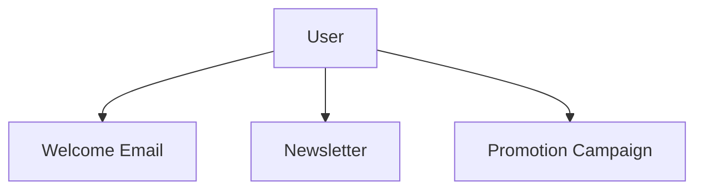
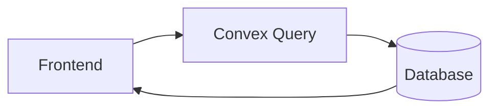
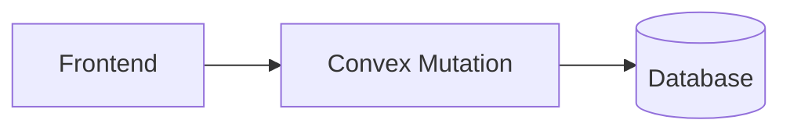
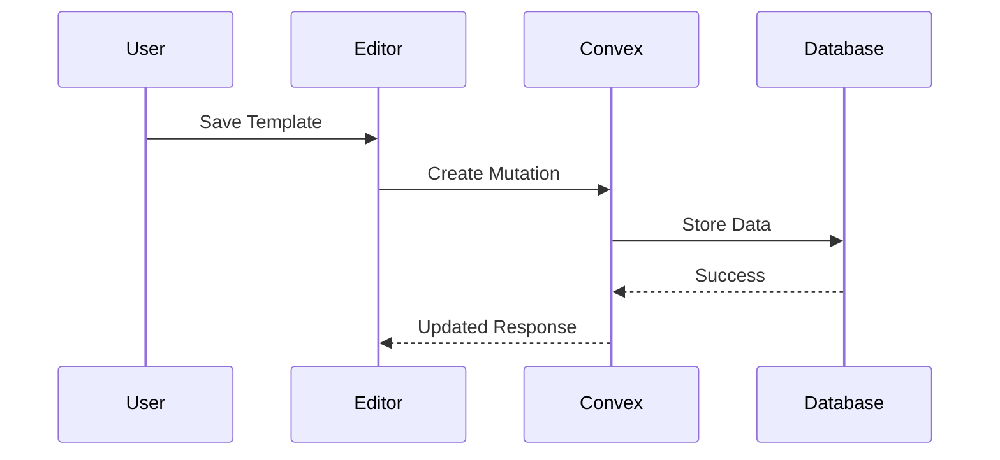
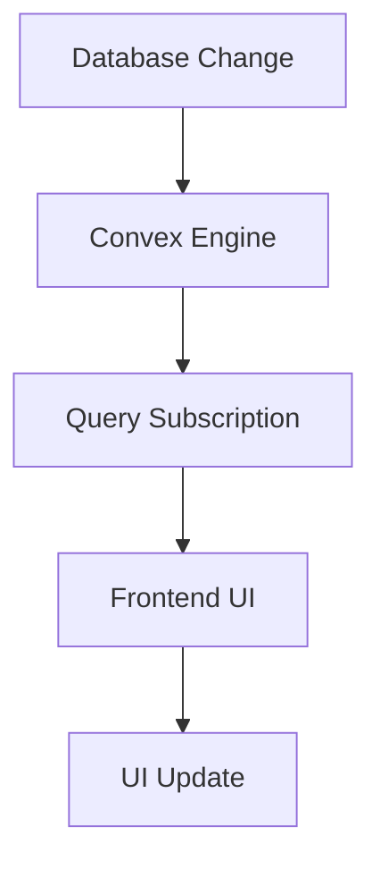
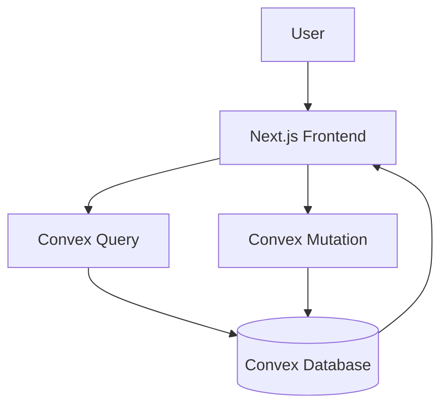

# Database Design Documentation

## Overview

AutoMailr AI uses **Convex** as its primary database and real-time backend service. The database layer is responsible for storing user information, managing email templates, synchronizing data in real time, and ensuring secure ownership of user-generated content.

Unlike traditional database architectures that require a separate backend server, Convex provides a reactive and serverless data layer that automatically synchronizes updates between the frontend and the database.

---

# Database Goals

The database architecture is designed to support:

* User authentication and management
* Email template storage
* Real-time synchronization
* Template ownership and access control
* Fast retrieval and updates
* Future scalability for campaigns and analytics

---

# Database Architecture



---

# Data Model

The database currently revolves around two primary entities:

1. Users
2. Email Templates



---

# Users Collection

The Users collection stores authenticated user information.

## Purpose

* Identify users
* Associate templates with owners
* Support authentication workflows

## Schema

```typescript
{
  name: string;
  email: string;
  image: string;
}
```

## Fields

| Field     | Type      | Description            |
| --------- | --------- | ---------------------- |
| id        | string    | Unique user identifier |
| name      | string    | Full name              |
| email     | string    | User email             |
| image     | string    | Profile image          |
| createdAt | timestamp | Account creation time  |

---

# Email Templates Collection

The Email Templates collection stores AI-generated and manually edited email templates.

Each template belongs to a specific user.

## Schema

```typescript
{
  userId: string;
  templateName: string;
  design: object;
  createdAt: number;
  updatedAt: number;
}
```

## Fields

| Field        | Type      | Description              |
| ------------ | --------- | ------------------------ |
| id           | string    | Template identifier      |
| userId       | string    | Owner reference          |
| templateName | string    | Template title           |
| design       | JSON      | Complete email structure |
| createdAt    | timestamp | Creation timestamp       |
| updatedAt    | timestamp | Last update timestamp    |

---

# Template Ownership Model

Every template belongs to exactly one user.



This ownership structure ensures proper data isolation and security.

---

# Template Structure

Templates are stored as JSON documents.

Example:

```json
{
  "templateName": "Welcome Email",
  "elements": [
    {
      "type": "text",
      "content": "Welcome to AutoMailr AI"
    },
    {
      "type": "button",
      "text": "Get Started"
    }
  ]
}
```

---

# Why JSON Storage?

Email templates are highly dynamic.

Different templates may contain:

* Different layouts
* Different numbers of components
* Nested structures
* Variable styling

Using JSON provides:

* Flexibility
* Easier serialization
* Faster development
* Future export compatibility

---

# Query Architecture

Queries are responsible for reading data.



## Common Queries

### Get Current User

Fetch authenticated user information.

### Get User Templates

Retrieve all templates belonging to a user.

### Get Template By ID

Retrieve a single template.

---

# Mutation Architecture

Mutations are responsible for creating, updating, and deleting records.



## Common Mutations

### Create Template

Stores a new template.

### Update Template

Updates existing template content.

### Delete Template

Removes a template.

### Create User

Stores new user information.

---

# Template Save Workflow



---

# Real-Time Synchronization

One of Convex's major advantages is automatic synchronization.



Benefits include:

* Instant updates
* No manual polling
* Improved user experience
* Consistent application state

---

# Data Flow

The following diagram shows how data moves through the application.



---

# Security Considerations

## User Isolation

Users should only access their own templates.

## Input Validation

Template data should be validated before storage.

## Authentication Verification

Database operations should verify ownership.

## Future Access Control

Future versions may support:

* Team Workspaces
* Shared Templates
* Role-Based Permissions

---

# Scalability Strategy

The current architecture supports:

* Thousands of users
* Thousands of templates
* Real-time updates

Future optimizations may include:

## Pagination

Load templates efficiently.

## Indexing

Improve query performance.

## Analytics Storage

Track template performance.

## Version History

Store historical template revisions.

---

# Future Database Enhancements

Planned collections include:

### Campaigns

Store email campaign information.

### Analytics

Track opens, clicks, and engagement.

### Template Versions

Maintain revision history.

### Team Workspaces

Enable collaboration.

### Shared Templates

Allow template sharing between users.

---

# Conclusion

The Convex database layer provides a scalable, reactive, and developer-friendly foundation for AutoMailr AI. Through structured template storage, real-time synchronization, and secure ownership management, the database architecture supports both current functionality and future platform growth.
