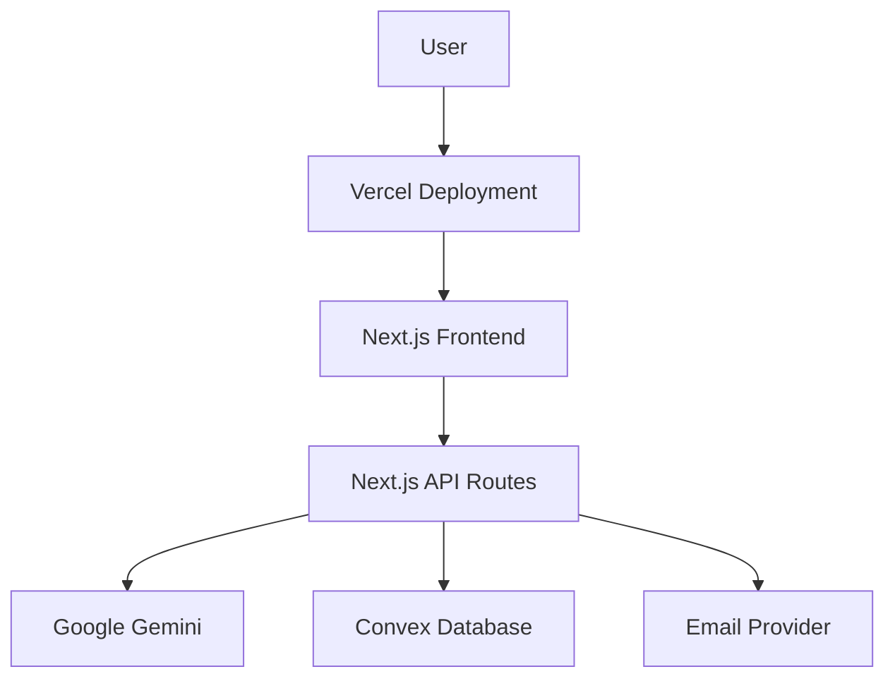
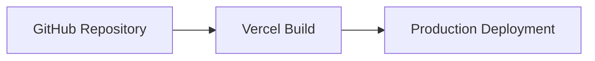
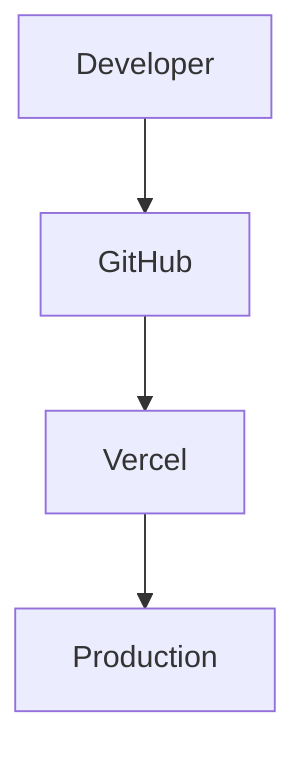

# Deployment Guide

## Overview

This document explains how to set up, configure, and deploy AutoMailr AI in both development and production environments.

The application is built using:

* Next.js 16
* React 19
* Convex
* Google Gemini AI
* Nodemailer
* Tailwind CSS

The recommended deployment stack is:

```text id="dj7vdt"
Frontend/API → Vercel
Database → Convex
AI Services → Google Gemini
Email Service → Nodemailer / SMTP Provider
```

---

# Deployment Architecture



---

# System Requirements

Before deployment ensure:

| Requirement    | Version  |
| -------------- | -------- |
| Node.js        | 18+      |
| npm            | 9+       |
| Convex Account | Required |
| Gemini API Key | Required |
| GitHub Account | Required |
| Vercel Account | Required |

---

# Local Development Setup

## Clone Repository

```bash
git clone https://github.com/Sanat1427/AutoMailr-ai.git

cd AutoMailr-ai
```

---

## Install Dependencies

```bash
npm install
```

---

## Configure Environment Variables

Create:

```text
.env.local
```

Add:

```env
NEXT_PUBLIC_CONVEX_URL=your_convex_url

GEMINI_API_KEY=your_gemini_api_key

EMAIL_USER=your_email

EMAIL_PASSWORD=your_password
```

---

## Start Development Server

```bash
npm run dev
```

Application:

```text
http://localhost:3000
```

---

# Convex Setup

## Install Convex CLI

```bash
npm install convex
```

---

## Login

```bash
npx convex login
```

---

## Initialize Convex

```bash
npx convex dev
```

This command:

* Creates a deployment
* Generates environment configuration
* Syncs schema changes

---

# Gemini AI Setup

## Create API Key

1. Visit Google AI Studio
2. Create API key
3. Copy generated key

Store:

```env
GEMINI_API_KEY=your_key
```

---

# Email Service Configuration

The project currently uses Nodemailer.

For development:

```javascript
const transporter = nodemailer.createTransport({
  host: "smtp.ethereal.email",
  port: 587,
  secure: false
});
```

---

# Recommended Production Providers

| Provider   | Recommended |
| ---------- | ----------- |
| Resend     | ✅           |
| SendGrid   | ✅           |
| Amazon SES | ✅           |
| Mailgun    | ✅           |

---

# Vercel Deployment

## Step 1: Push Code

```bash
git add .

git commit -m "Production Ready"

git push origin main
```

---

## Step 2: Import Project

1. Login to Vercel
2. Import GitHub Repository
3. Select AutoMailr AI

---

## Step 3: Configure Environment Variables

Add:

```env
NEXT_PUBLIC_CONVEX_URL=

GEMINI_API_KEY=

EMAIL_USER=

EMAIL_PASSWORD=
```

---

## Step 4: Deploy

Click:

```text
Deploy
```

Vercel automatically:

* Installs dependencies
* Builds application
* Generates production deployment

---

# Production Build Process



---

# Continuous Deployment Workflow

Every push to the main branch triggers deployment.



---

# Environment Variable Management

## Development

```text
.env.local
```

## Production

Managed through:

```text
Vercel Environment Variables
```

Never commit secrets to GitHub.

---

# Deployment Checklist

Before production deployment:

* [ ] Environment variables configured
* [ ] Convex deployment active
* [ ] Gemini API working
* [ ] Email provider configured
* [ ] Build passes locally
* [ ] API routes tested
* [ ] Templates save correctly
* [ ] Email sending verified

---

# Monitoring Strategy

Recommended monitoring tools:

| Tool             | Purpose              |
| ---------------- | -------------------- |
| Vercel Analytics | Frontend Performance |
| Convex Dashboard | Database Monitoring  |
| Google AI Studio | AI Usage Tracking    |
| Sentry           | Error Monitoring     |

---

# Performance Optimization

## Frontend

* Lazy loading
* Component optimization
* Route-based code splitting

## Backend

* Reduce AI calls
* Cache repeated requests
* Validate requests early

## Database

* Query optimization
* Pagination
* Selective subscriptions

---

# Scaling Strategy

As user traffic grows, the system can scale through:

## AI Layer

Support multiple providers:

* Gemini
* GPT
* Claude

---

## Email Layer

Switch from Nodemailer testing to:

* Resend
* SendGrid
* SES

---

## Data Layer

Introduce:

* Indexing
* Archival storage
* Analytics databases

---

# Disaster Recovery

Critical data includes:

* User accounts
* Templates
* Campaign configurations

Recommended practices:

* Database backups
* Version control
* Environment variable backups
* Deployment rollback support

---

# Security Best Practices

## API Keys

Store only in environment variables.

## Input Validation

Validate all user inputs.

## Rate Limiting

Protect AI endpoints from abuse.

## Authentication

Verify ownership before accessing templates.

---

# Future Infrastructure Enhancements

Planned improvements:

* Docker Support
* Kubernetes Deployment
* CI/CD Pipelines
* Multi-Region Deployment
* Edge Functions
* Queue-Based Email Processing
* Worker-Based AI Processing

---

# Conclusion

The deployment architecture of AutoMailr AI is designed for simplicity, scalability, and maintainability. By leveraging Vercel, Convex, Gemini AI, and modern cloud infrastructure, the platform can be deployed quickly while remaining flexible enough to support future growth and enterprise-scale features.
