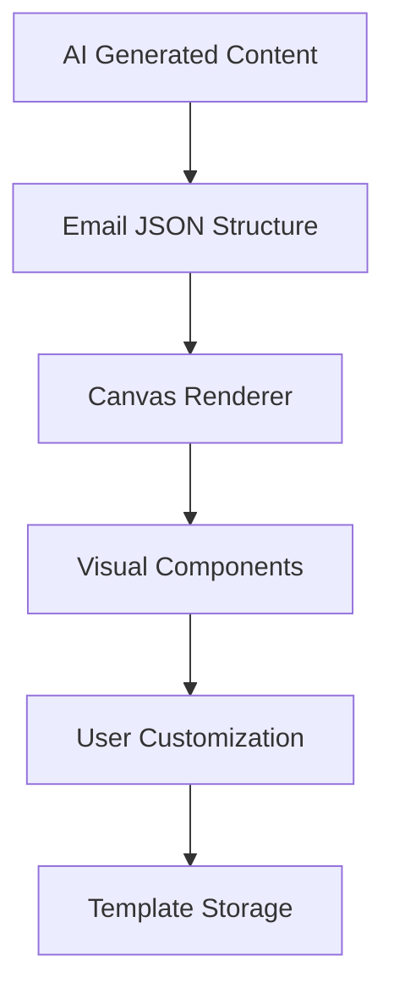
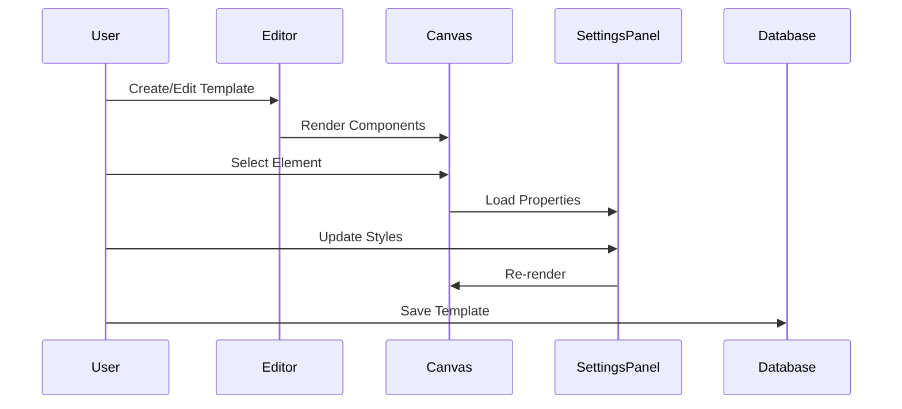
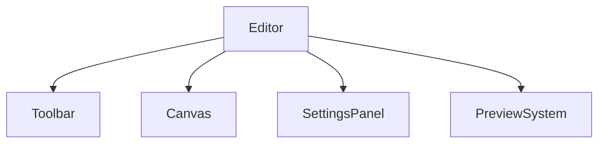
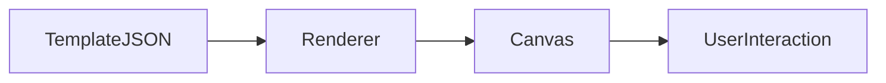
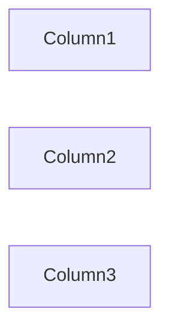
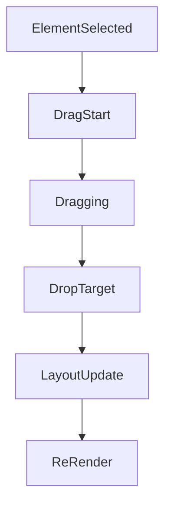
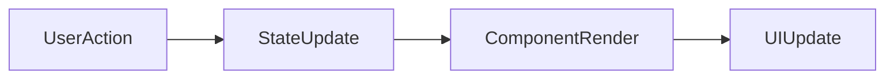
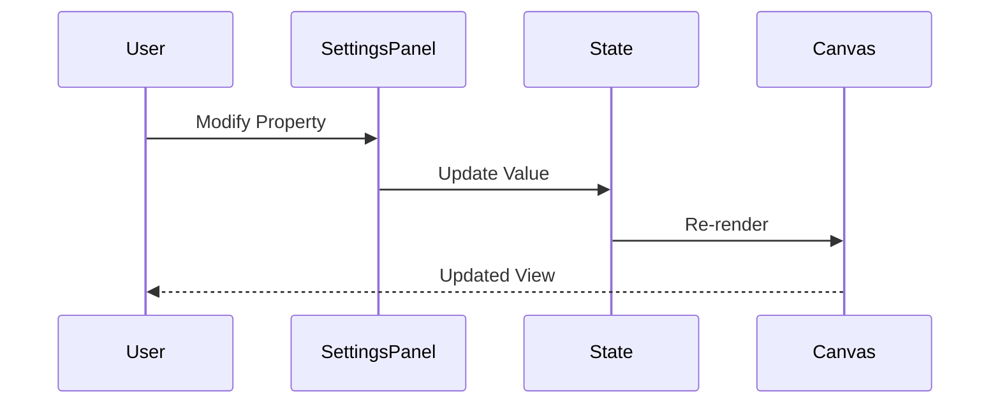
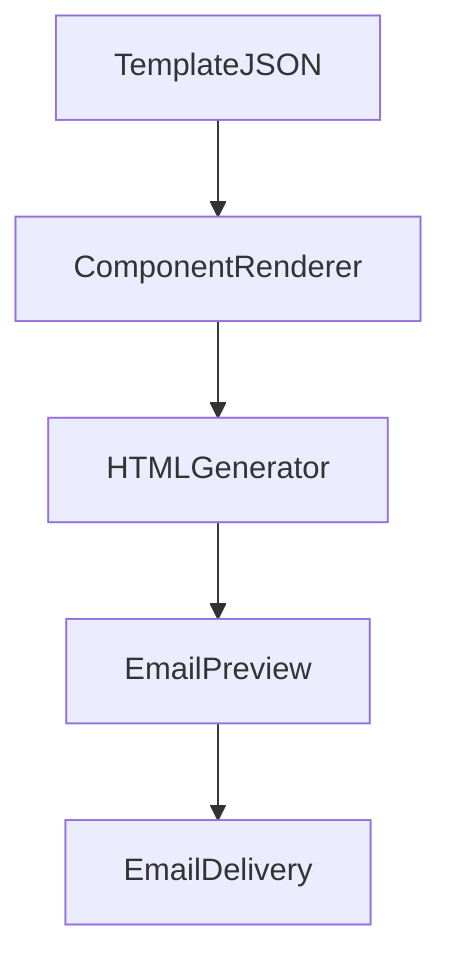
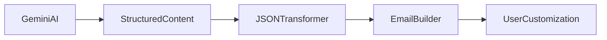

# Email Builder Architecture

## Overview

The Email Builder is the core user-facing component of AutoMailr AI. It provides a visual drag-and-drop interface that enables users to create, modify, and customize professional email templates without writing HTML or CSS.

The builder transforms AI-generated content into editable UI components while allowing users to modify layouts, styles, content, and branding elements in real time.

The system follows a component-driven architecture where every email element is represented as a structured object that can be rendered, edited, persisted, and reused.

---

# Design Goals

The Email Builder was designed with the following objectives:

### No-Code Editing

Allow users to create professional email layouts without technical knowledge.

### Real-Time Feedback

Reflect all changes instantly within the editor canvas.

### Reusable Components

Represent email sections as reusable blocks.

### AI Compatibility

Enable AI-generated content to be seamlessly converted into editable elements.

### Template Persistence

Support saving and restoring complete email designs.

---

# High-Level Architecture



---

# Builder Workflow

The editor follows a structured workflow.



---

# Core Components

The builder consists of four primary layers:



---

# Canvas Layer

The canvas serves as the central workspace where email components are rendered.

Responsibilities:

* Display email elements
* Support drag-and-drop operations
* Handle selection events
* Manage element ordering
* Provide visual feedback

---

## Canvas Rendering Flow



The renderer converts stored JSON structures into React components.

---

# Element System

Every piece of content inside an email is represented as an element.

Examples include:

* Text
* Button
* Image
* Logo
* Divider
* Social Media Section
* Columns

Each element contains:

```json
{
  "id": "element_1",
  "type": "text",
  "content": "Welcome to AutoMailr AI",
  "styles": {}
}
```

This approach makes every element editable and reusable.

---

# Supported Element Types

## Text Element

Used for:

* Headlines
* Paragraphs
* Descriptions

Properties:

* Font Size
* Font Weight
* Alignment
* Color
* Padding

---

## Button Element

Used for call-to-action sections.

Properties:

* Text
* URL
* Background Color
* Border Radius
* Padding

Example:

```json
{
  "type": "button",
  "text": "Get Started",
  "url": "#"
}
```

---

## Image Element

Used for:

* Product Images
* Hero Images
* Logos

Properties:

* Source URL
* Width
* Height
* Alignment

---

## Divider Element

Provides visual separation between sections.

Properties:

* Thickness
* Width
* Color

---

## Multi-Column Layout

Supports responsive content organization.

Example:



Useful for:

* Feature sections
* Pricing comparisons
* Product showcases

---

# Drag-and-Drop Architecture

The drag-and-drop system allows users to rearrange content visually.



---

# State Management

The editor maintains application state for:

* Active template
* Selected component
* Component hierarchy
* Style configuration



This ensures that every interaction produces immediate visual feedback.

---

# Property Editor

The Settings Panel acts as a property editor.

Responsibilities:

* Load selected element properties
* Modify styling
* Update content
* Trigger re-rendering

---

## Property Update Flow



---

# Template Serialization

Templates are stored as structured JSON documents.

Benefits:

* Easy persistence
* Fast retrieval
* Portable design format
* Future export support

Example:

```json
{
  "templateName": "Welcome Campaign",
  "elements": [
    {
      "type": "text",
      "content": "Welcome!"
    },
    {
      "type": "button",
      "text": "Get Started"
    }
  ]
}
```

---

# Preview System

Before sending emails, users can preview the final output.

The preview module:

* Renders final HTML
* Simulates email layout
* Validates responsiveness
* Displays production output

---

# Email Rendering Pipeline



---

# Integration with AI Generation

The Email Builder is tightly integrated with the AI pipeline.



AI-generated content immediately becomes editable inside the builder.

---

# Scalability Considerations

The builder architecture supports future enhancements.

Planned features include:

### Template Marketplace

Share reusable email templates.

### Collaborative Editing

Allow multiple users to edit simultaneously.

### Version History

Track changes across template revisions.

### Undo / Redo Support

Improve editing workflow.

### Custom Components

Allow users to define reusable blocks.

---

# Challenges & Design Decisions

## Challenge 1: AI Output Consistency

AI-generated content may vary in structure.

Solution:

* Validation Layer
* JSON Normalization
* Component Mapping

---

## Challenge 2: Real-Time Rendering

Frequent updates can impact performance.

Solution:

* Component-level updates
* Efficient state management
* Incremental rendering

---

## Challenge 3: Template Persistence

Complex layouts must be stored reliably.

Solution:

* JSON-based serialization
* Structured element hierarchy

---

# Future Improvements

Upcoming enhancements include:

* Advanced Drag-and-Drop Interactions
* Responsive Mobile Preview
* Dynamic Content Blocks
* MJML Export
* HTML Export
* Email Client Compatibility Testing
* Live Collaboration
* Theme System

---

# Conclusion

The Email Builder serves as the visual foundation of AutoMailr AI. By combining structured templates, reusable components, real-time editing, and AI-generated content, the system provides a flexible and scalable solution for creating professional email campaigns without requiring coding expertise.
