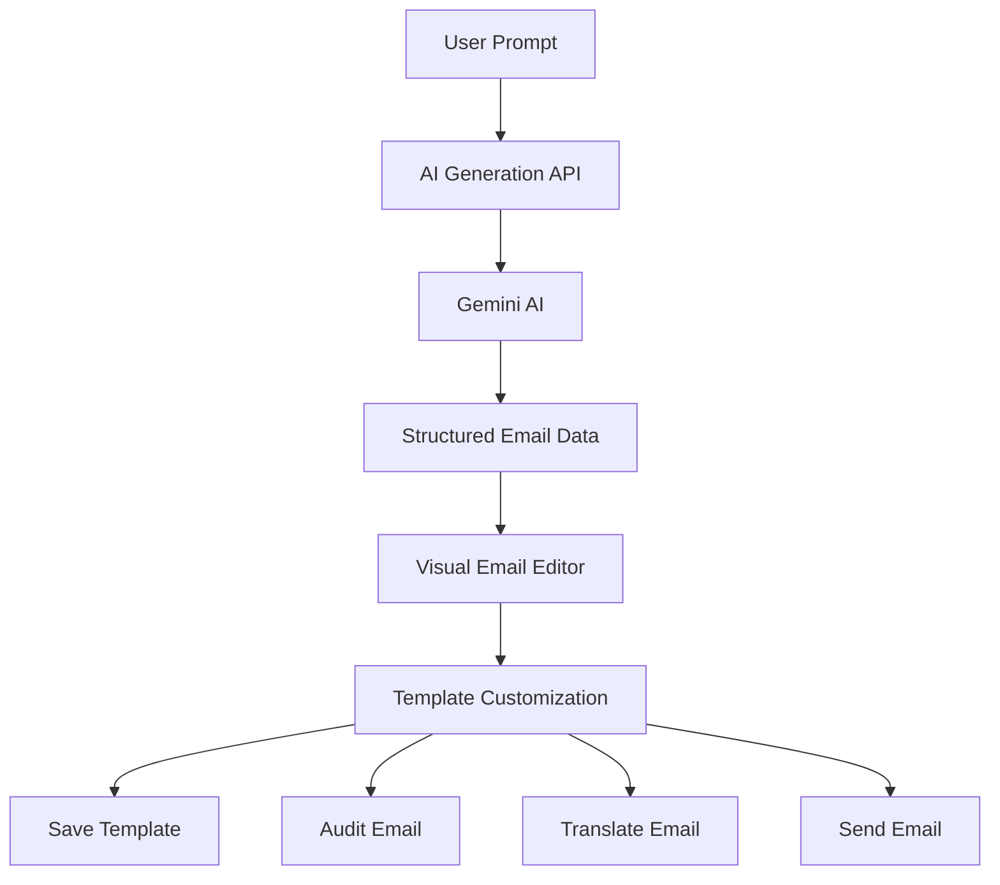
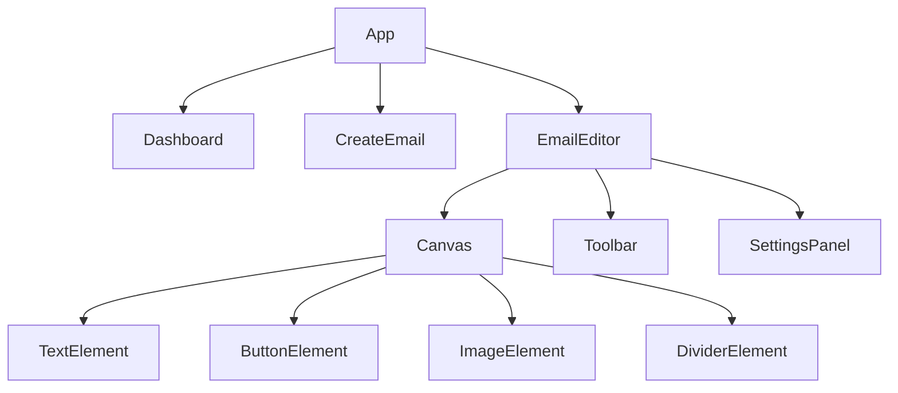
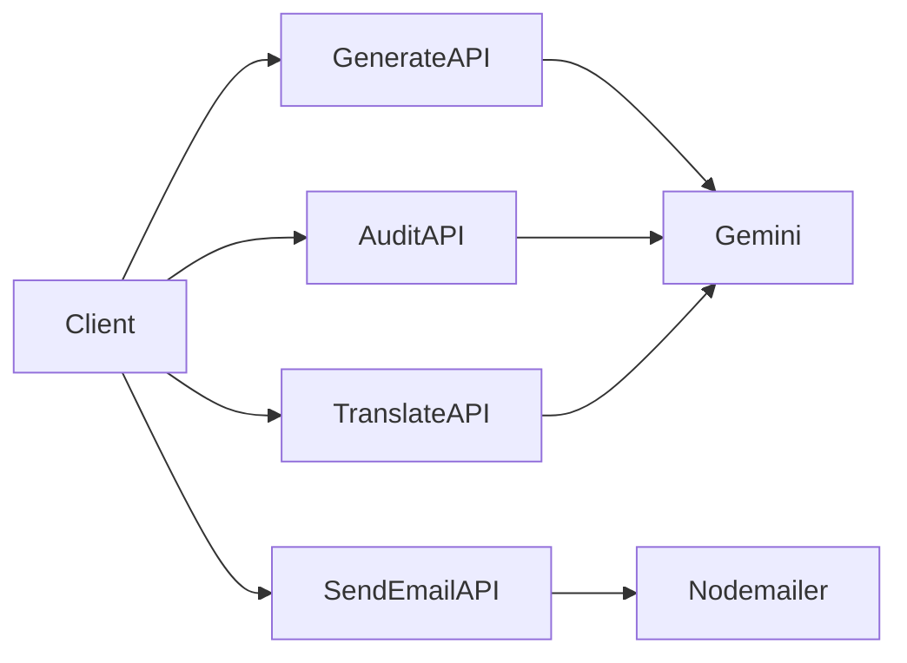
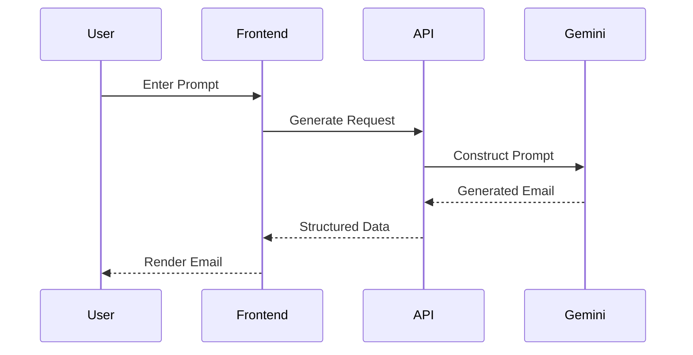
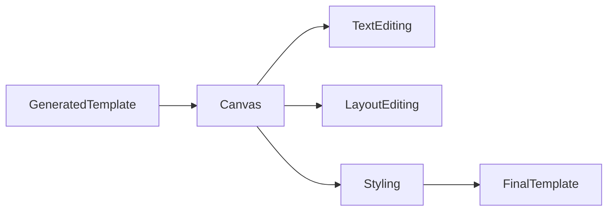
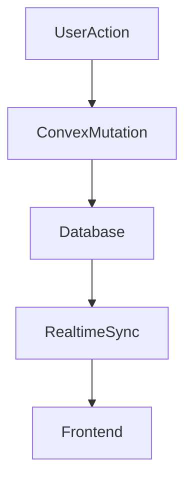
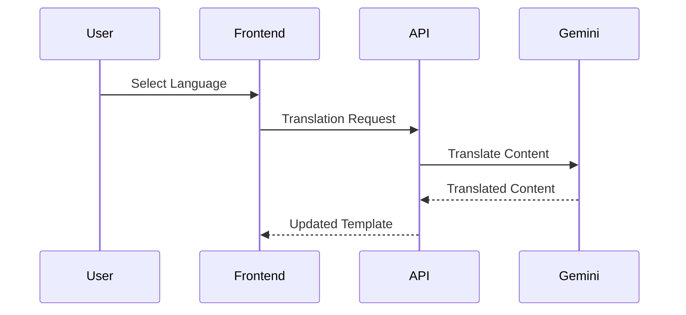
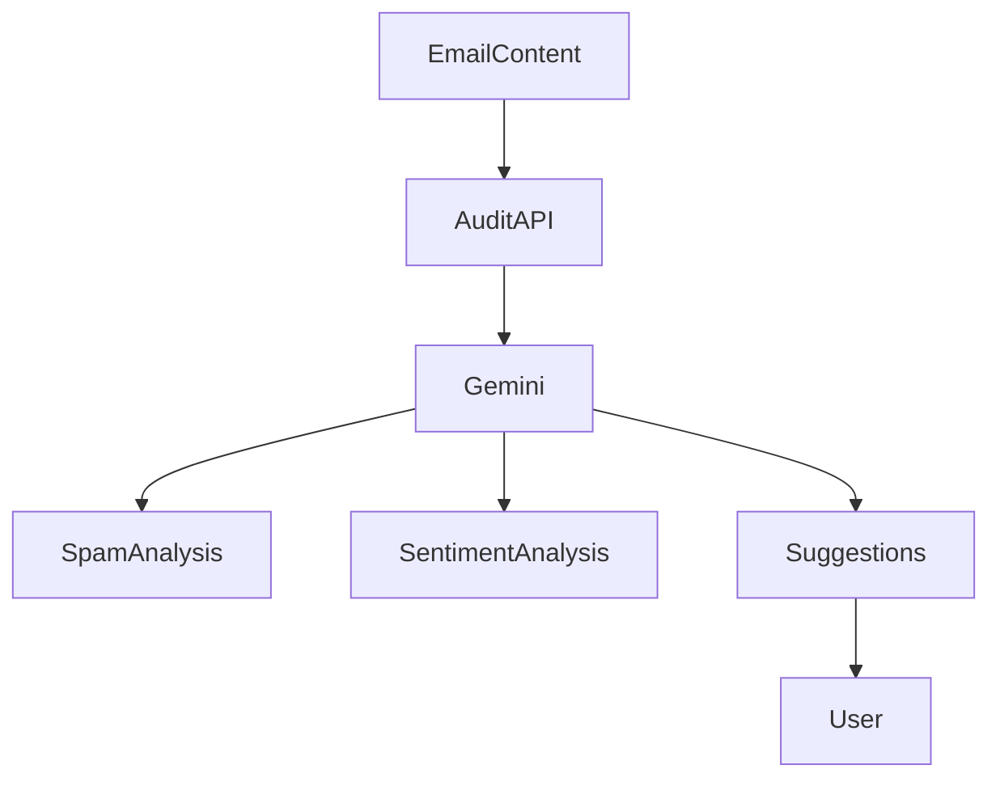

# System Design Document

## Overview

AutoMailr AI is a full-stack AI-powered email creation platform designed to automate the process of generating, customizing, optimizing, translating, and sending professional email campaigns.

The system combines Large Language Models (LLMs), a drag-and-drop visual editor, real-time template management, and email delivery services into a unified workflow.

This document describes the system's functional requirements, non-functional requirements, design decisions, component interactions, and scalability considerations.

---

# Design Goals

The primary objectives behind AutoMailr AI are:

### 1. Rapid Email Creation

Enable users to generate professional email templates within seconds using natural language prompts.

### 2. Visual Editing Experience

Provide a no-code drag-and-drop interface that allows users to customize generated templates without HTML knowledge.

### 3. AI-Assisted Optimization

Improve email quality through AI-powered auditing, content enhancement, and translation capabilities.

### 4. Reusable Templates

Allow users to store, edit, and reuse templates for future campaigns.

### 5. Extensibility

Design the system in a modular manner so additional AI features and email providers can be integrated easily.

---

# Functional Requirements

## Email Generation

Users should be able to:

* Enter natural language prompts
* Generate complete email templates
* Regenerate content
* Edit generated content

Example:

```text id="f1h2s9"
Create a promotional email for a new AI-powered productivity application.
```

---

## Template Editing

Users should be able to:

* Add components
* Delete components
* Rearrange components
* Modify styles
* Update content

Supported Elements:

* Text
* Buttons
* Images
* Logos
* Dividers
* Social Media Blocks
* Multi-column Layouts

---

## Template Storage

The system should support:

* Saving templates
* Updating templates
* Fetching templates
* User-specific template ownership

---

## Translation

Users should be able to:

* Select a target language
* Translate email content
* Preserve structure and formatting

---

## Email Audit

Users should be able to:

* Analyze spam score
* Detect risky keywords
* Evaluate sentiment
* Receive optimization suggestions

---

## Email Delivery

Users should be able to:

* Send test emails
* Preview rendered emails
* Verify email formatting

---

# Non-Functional Requirements

## Performance

The platform should:

* Generate emails within a few seconds
* Render editor updates instantly
* Support real-time template retrieval

---

## Scalability

The architecture should support:

* Thousands of templates
* Multiple users
* Future bulk email delivery

---

## Reliability

The system should:

* Handle AI response failures
* Recover from invalid outputs
* Prevent template corruption

---

## Maintainability

The codebase should provide:

* Clear module separation
* Reusable components
* Independent service layers

---

# High-Level System Flow



---

# Component Design

## Frontend Layer

The frontend is built using Next.js App Router.

### Responsibilities

* User interaction
* Visual editing
* State management
* API communication
* Live preview rendering

---

### Frontend Component Hierarchy



---

# Backend Layer

The backend is implemented using Next.js API Routes.

Each API endpoint performs a dedicated responsibility.



---

# AI Processing Pipeline

The AI pipeline converts natural language prompts into structured email templates.



---

# Email Editing Workflow

After generation, users enter the editing stage.



---

# Template Storage Workflow

Templates are persisted using Convex.



---

# Translation Workflow



---

# Audit Workflow



---

# Scalability Strategy

The current architecture is optimized for rapid development and moderate-scale usage.

Future scaling improvements include:

### Queue-Based Processing

Move AI generation and email sending to background workers.

### Caching

Cache commonly generated templates and prompts.

### Provider Abstraction

Support multiple AI providers:

* Gemini
* OpenAI
* Claude

### Email Service Abstraction

Support multiple delivery providers:

* SendGrid
* Resend
* Amazon SES
* Mailgun

---

# Design Trade-Offs

| Decision           | Benefit                   | Trade-Off                         |
| ------------------ | ------------------------- | --------------------------------- |
| Gemini AI          | Fast content generation   | External API dependency           |
| Convex             | Real-time synchronization | Vendor dependency                 |
| Next.js API Routes | Simpler architecture      | Limited background processing     |
| Nodemailer         | Easy email testing        | Not ideal for high-volume sending |

---

# Future Enhancements

Planned improvements include:

* Campaign Scheduling
* Analytics Dashboard
* Team Collaboration
* Template Marketplace
* Version History
* A/B Testing
* Bulk Email Campaigns
* Multi-Provider AI Support

---

# Conclusion

AutoMailr AI is designed as a modular and extensible email automation platform. By combining AI-powered content generation, visual editing capabilities, template persistence, and email delivery into a single workflow, the system significantly reduces the effort required to create and launch professional email campaigns.
